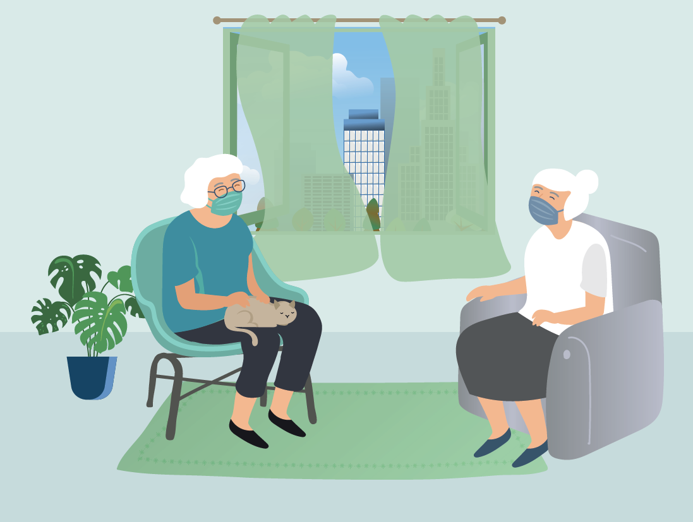

# Gut durch die Sommerhitze während erhöhtem Infektionsschutz

## Informationen für ältere Menschen ab 65 Jahren

Institut und Poliklinik für Arbeits-, Sozial- und Umweltmedizin des LMU Klinikums

 * [Web](https://health-sprints.github.io/KLI/#/)
 * [Webbuch](https://health-sprints.github.io/KLI-server/webbook/#src=kli&bookMode=true)
 * [PDF](https://health-sprints.github.io/KLI-server/pdf/book.pdf)

Autoren:

Stephan Böse-O´Reilly

Katharina Deering

Hanna Mertes

Julia Schoierer

www.klimawandelundbildung.de

Grafik:

Petra Morcher

PeMoCoDe
